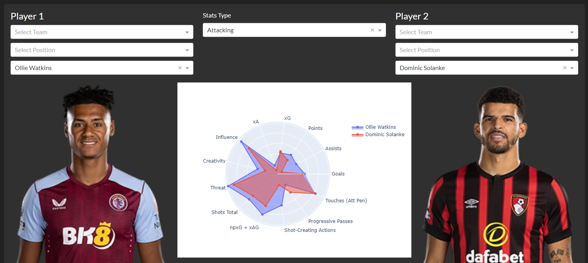

# FPL Dashboard
Portfolio project - Fantasy Premier League data dashboard.

The app is avaiable [here](https://fpl-analytics.onrender.com/).

## General Data
It uses the up to date data from the official FPL web api (https://fantasy.premierleague.com/api/bootstrap-static/). The charts provide the insite to the most "cost efficient" assets in the game, both offensively and deffensively.

## Player comparison
It contains the players comparison tool. The tool combines the data from Fantasy Premier League game and the data scrapped using BeautifulSoup from [Fbrev](https://fbref.com/en/), a website which aggregates football statistics.

